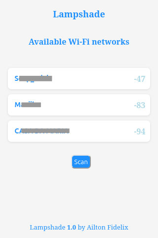
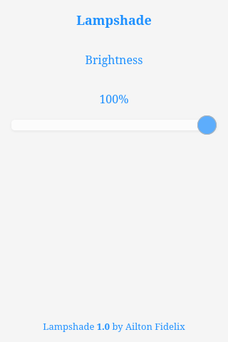

# Lampshade project

Lampshade using ESP32-C3 on ESP-IDF with C++17. The light will be controlled over WiFi using an HTTP server.

## Requirements

- ESP-IDF v5.2.2
- C++ 17

## Build & Flash

Having the ESP-IDF installed and it activated, plug your ESP32-C3 and run the command below:

```bash
python3 run.py
```

Or just

```bash
./run.py
```

This python script will build the project and flash it into your ESP32-C3.

## Connecting to the device network

After flashing the code, the ESP32-C3 will start in **AP** mode.

| SSID | Password |
| --- | --- |
| Lampshade | 12345678 |

Once you are connected on the Lampshade network, you can acces de WiFi manager page:

[http://lampshade.local](http://lampshade.local)

The image below is how the manager looks like:



On the manager screen we only need to select the network, enter it password and click connect. The device will restart in **STA** mode and connect to the informed network.

**Note:** While the device is not connected to a network, the led will blink each 80ms. In **AP** mode the led blinks each 1s.

## Controlling the LED

With the device connected on your network, you can just access the Lampshade page:

[http://lampshade.local](http://lampshade.local)

The image below is how the lampshade page looks like:



**Note:** To indicate that the device is connected into the network, the led stops blinking and turn on.

### Author

Create by Ailton Fidelix

[](https://www.linkedin.com/in/ailton-fidelix-9603b31b7/)